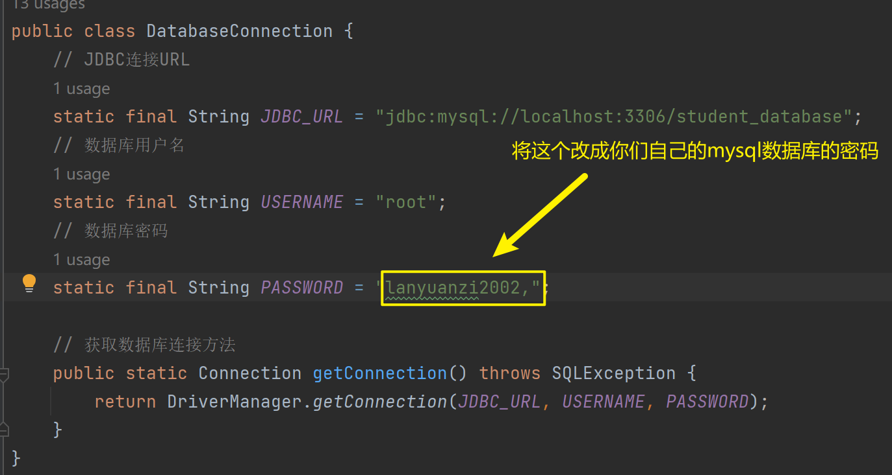

## 准备说明

我们使用了 Java 连接 mysql 数据库，使用 python 进行文字识别和提取，失物招领模块使用文件操作而不是数据库

### Mysql

1. 安装并配置 mysql，参考 b 站 mysql 黑马程序员 p3-mysql 的安装与启动<https://www.bilibili.com/video/BV1Kr4y1i7ru/?spm_id_from=333.337.search-card.all.click&vd_source=d516535fec15571274754b4d01232207>
2. 在 idea 中查看 mysql 数据库，参考<https://www.bilibili.com/video/BV1DR4y1z7Lv/?spm_id_from=333.337.search-card.all.click&vd_source=d516535fec15571274754b4d01232207>
3. 在 mysql 中创建 student_database 的数据库，并在数据库中创建 learning_materials,canteenWindows,teachers,students,menu 表，代码如下：

   ```sql
   create database student_database;
   use student_database;
   CREATE TABLE students (
       id INT AUTO_INCREMENT PRIMARY KEY,
       name VARCHAR(20) NOT NULL,
       nickname VARCHAR(20) NOT NULL,
       sid VARCHAR(15) NOT NULL,
       password VARCHAR(20) NOT NULL
   );

   CREATE TABLE teachers (
       id INT AUTO_INCREMENT PRIMARY KEY,
       name VARCHAR(20) NOT NULL,
       nickname VARCHAR(20) NOT NULL,
       tid VARCHAR(15) NOT NULL,
       password VARCHAR(20) NOT NULL
   );

   CREATE TABLE canteenWindows (
       id INT AUTO_INCREMENT PRIMARY KEY,
       name VARCHAR(20) NOT NULL,
       nickname VARCHAR(20) NOT NULL,
       cid VARCHAR(15) NOT NULL,
       password VARCHAR(20) NOT NULL
   );
   create table menu(
       cid varchar(15) references canteenWindows(cid),
       name varchar(10) not null,
       price double not null
   );
   create table learning_materials(
       name varchar(50),
       type varchar(20),
       upload_time datetime,
       score double,
       comment varchar(100)
   );
   ```

4. 找到 databaseConnection 包-DatabaseConnection 类，然后作如下修改：  
   
5. 下载并在 idea 上配置 jdbc <https://blog.csdn.net/FuTian0715/article/details/129699894>

### 文件操作

1. 创建一个 txt 文件，复制保存路径
2. lostAndFoung-entity-LostAndFoundSystem,然后作如下更改：
   

### 文字识别和提取

- 安装并配置 anaconda（虽然你们应该已经配置好了），参考链接<https://www.bilibili.com/video/BV1ns4y1T7AP/?spm_id_from=333.999.0.0&vd_source=d516535fec15571274754b4d01232207>
